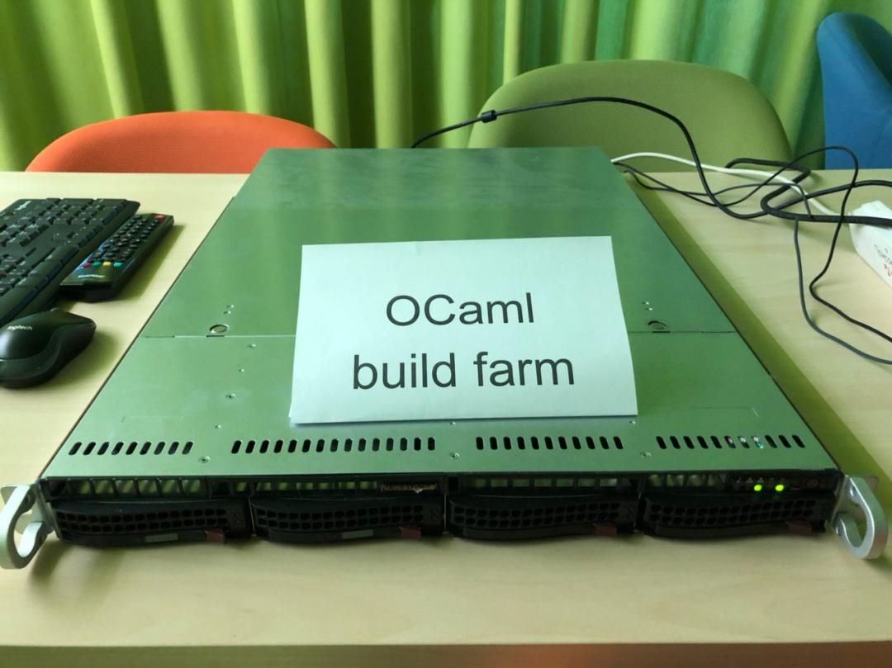

Greetings, space travelers!

You have crossed borders of the Galactic Dominion of Bashkortostan, the jewel of the Universe. We welcome you heartily into our democratic environment, and wish you a safe journey.

> **AD**: Don't be a plebian -- run Debian. ♫♫

**NOTICE**: During the last 72 hours our AI has studied the signals emitted by your ship and determined a breach of law (see **EVIDENCE**). The automated verdict is to **EXTERMINATE**. Please, do not leave your ship until it is destroyed by deadly lasers.

> **AD**: Gilette™ -- our razors shave like lasors. ♫♫

Have a nice day!

...

Press **A** to disable targeted **AD**s (0.1 BTC).

Press **N** to disable **NOTICE**s.

Press **I** to learn about **AI**.

Press **E** to learn about **EVIDENCE**.

Press **X** to learn about **EXTERMINATION**.

...

# AI

```lisp
'((:id . WILD-BASHKORT-MAGES)
  (:date . "2020-08-20")
  (:authors .
   ((DAMIR-AKHMETZYANOV . (@ linesprower gmail-com))
    (MAX-MOURATOV . (@ mmouratov gmail-com))
    (ARTEM-RIPATTI . (@ ripatti inbox-ru)))))
```

...

# EVIDENCE

Information uncovered with **HUBBLE**, **PAD**, and **EVAL** leads to conclusion that the recieved signal, which is contained in `galaxy.txt`, is a computer program in an unknown Turing-complete language, use of which is unauthorized by Bureau of Computation.

...

Press **H** to learn about **HUBBLE**.

Press **P** to learn about **PAD**.

Press **E** to learn about **EVAL**.

...

# HUBBLE

```lisp
'((:files . ("hubble.ml"))
  (:language . OCaml)
  (:requirements .
    ((:debian . "apt install ocaml libzarith-ocaml-dev libcurl-ocaml-dev")
     (:opam . "opam depext -i zarith ocurl")
     (:windows . GOOD-LUCK)))
  (:build-command . "make hubble")
  (:run-command . "./hubble"))
```

**HUBBLE** is a simplified-construction `galaxy` evaluator. Despite simplicity (main loop is around 50 LOCs), it sports good enough speed for the rapid exploration of `galaxy`. A highlight of the design is an exemplary use of the OCaml's `lazy` operator. Also, input variables are tabulated -- compressed into a compact array -- which gives an additional boost.

Press O to learn about **OCAML**.

...

# PAD

```lisp
'((:files . ("pad.py"))
  (:language . Python)
  (:run-command . "python3 pad.py ./hubble"))
```

**PAD** is a graphical front-end to **HUBBLE**.


Trivia:
- Can also take **EVAL** as second argument.
- Is fast on Linux, because of Tk.
- Is slow on Windows, because of Tk.
- First entry field is Interact vector.
- Second entry field is Interact state.
- Point mouse cursor to the first column of a number to parse it.

...

# EVAL

```lisp
'((:files . ("eval/main.cpp" "eval/botapi.h" "eval/bot.h" "eval/bot.cpp"))
  (:language . C++)
  (:build-command . "cd eval; make eval_release")
  (:run-command . "eval/eval"))
```

**EVAL** is an advanced-construction `galaxy` evaluator tailored for real-time use.

Highlights: aggressive caching strategy, custom memory manager (bump allocation arena).

During the exploration of `galaxy` we have stumbled upon an illegal fight club, in which we participated, for science. Thus, EVAL includes an AI (produced by our **AI**) that controls battle ships through the graphical interface provided by `galaxy`. The AI does all the regular stuff -- flying around, shooting enemies (with deadly lasers), exploding when needed. On each turn of the battle, AI detects ships (by visual recognition) and clicks on those ships to read stats (recognizing numbers). It knows how to handle ships that overlap (including forked ones, which can be numerous), by additional clicking (to cycle through ships under point). Once the AI collects data, it performs a move, by clicking on its own ships and handling controls with precise actuations.

Pulling that off required a *fast* evaluator.

In process of building the AI, which was arduous, we received your pitiful suggestion to play the tournament through a trivial API, bypassing `galaxy` altogether, which implied insignificance of our past developments and a mockery of our skills. The Galactic Dominion of Bashkortostan would never succumb to accepting such pittance. Our limitless ambition and imagination are merely footnotes to our pride. And using the API would betray our principles.

Yes, we haven't won. And yet. The history of our glory. Continues to be written. Forever.

...

# OCAML

As can be witnessed by studying contents of the `submission` branch, OCaml is world's best language. Thankfully, the `ocaml` docker container was well prepared for this glory, even though it required a separate build farm:



One stunning feat of our intelligence agency was smuggling in Z3, an industrial-strength SMT-solver, compiling which required many gigabytes of RAM. SMT-solvers are like that: you never know when you need one (especially if it's suggested that you should sharpen your numerals).

A decoy was put in place to diverse attention:


Stierlitz was close to failure, but it worked out, and now our submission is a shining monument to OCaml's greatness.

...

# EXTERMINATE

Deadly lasers now. Sayōnara.
